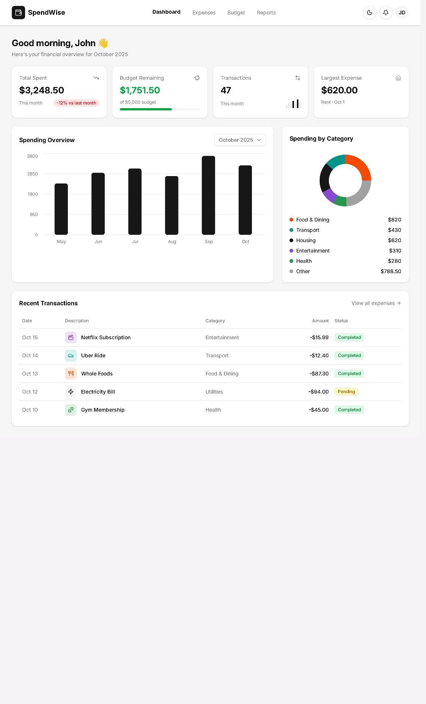
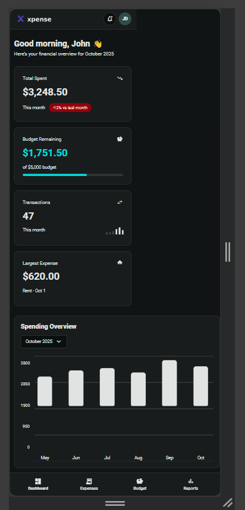
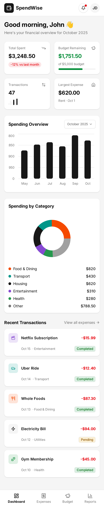

# Xpense Frontend

Angular SSR frontend for the Xpense expense tracker.

Live app: [https://expense-tracker-fe-o0wf.onrender.com](https://expense-tracker-fe-o0wf.onrender.com)

## Screenshots







## Tech Stack

- Angular 21
- Angular SSR with Express
- Angular Material
- Chart.js
- Bootstrap utility CSS

## Local Development

Install dependencies:

```bash
npm install
```

Start the development server:

```bash
npm run start
```

Open:

```text
http://localhost:4200
```

## Environment

The SSR server exposes runtime config at `/api/config`.

Set this in `.env` or on the deployment provider:

```text
API_BASE_URL=https://expense-tracker-be-woo0.onrender.com/api
```

## Build

```bash
npm run build
```

## Run SSR Build

```bash
npm run serve:ssr:expense-tracker-fe
```

## Render Deployment

Render service settings:

```text
Runtime: Node
Build Command: npm ci && npm run build
Start Command: npm run serve:ssr:expense-tracker-fe
```

Environment variable:

```text
API_BASE_URL=https://expense-tracker-be-woo0.onrender.com/api
```

The backend must include this frontend origin in `CORS_ORIGIN` because authentication uses HttpOnly cookies.

If the Render hostname changes, add the new host to `security.allowedHosts` in `angular.json`.
